# 🌐 JIMMY.KUMPULAINEN.SE

```ascii
 ██████╗██╗   ██╗██████╗ ███████╗██████╗ ██████╗ ██╗   ██╗███╗   ██╗██╗  ██╗
██╔════╝╚██╗ ██╔╝██╔══██╗██╔════╝██╔══██╗██╔══██╗██║   ██║████╗  ██║██║ ██╔╝
██║      ╚████╔╝ ██████╔╝█████╗  ██████╔╝██████╔╝██║   ██║██╔██╗ ██║█████╔╝
██║       ╚██╔╝  ██╔══██╗██╔══╝  ██╔══██╗██╔═══╝ ██║   ██║██║╚██╗██║██╔═██╗
╚██████╗   ██║   ██████╔╝███████╗██║  ██║██║     ╚██████╔╝██║ ╚████║██║  ██╗
 ╚═════╝   ╚═╝   ╚═════╝ ╚══════╝╚═╝  ╚═╝╚═╝      ╚═════╝ ╚═╝  ╚═══╝╚═╝  ╚═╝
                                   C.V v2.077
```

**🤖 NEURAL NETWORK STATUS: FULLY OPERATIONAL**
**🔮 AI GENERATION LEVEL: MAXIMUM SYNTHWAVE**
**⚡ CYBERPUNK AESTHETICS: ENGAGED**

[](https://github.com/yelo/jimmy.kumpulainen.se/actions/workflows/build-and-deploy.yml)
[](https://github.com/yelo/jimmy.kumpulainen.se/actions/workflows/codeql.yml)

Welcome to the matrix, digital wanderer. This repository houses the source code for a cutting-edge CV website that exists at the intersection of artificial intelligence and pure neon-soaked cyberpunk aesthetics.

## 🚀 SYSTEM SPECIFICATIONS

This isn't just another static website—it's a **fully AI-generated digital persona** crafted with the precision of a master code samurai and the style of a street-smart netrunner. Every pixel pulses with cyberpunk energy, every animation flows like data streams through the neural pathways of the web.

### ⚡ Core Features

- **🎨 Pure Cyberpunk Aesthetics**: Glitch effects, neon colors, and terminal-inspired design
- **🤖 AI-Generated Content**: Crafted by artificial intelligence for maximum digital authenticity
- **⚙️ Optimized Build Pipeline**: Advanced minification for HTML, CSS, and JavaScript
- **🛡️ Security Scanning**: CodeQL analysis for bulletproof code integrity
- **🌐 Azure Static Web Apps**: Lightning-fast global deployment

### 🔧 Build & Deploy Pipeline

The site undergoes a sophisticated build process that would make any tech corp proud:

1. **🔍 CodeQL Security Analysis**: Separate workflow that scans JavaScript code for vulnerabilities on every push and pull request
2. **⚡ Asset Minification**:
   - HTML compression using system minify tools
   - CSS minification for lean stylesheets
   - JavaScript compression and optimization
3. **🚀 Azure Deployment**: Automatic deployment to Azure Static Web Apps on every push to main

### 🏗️ Infrastructure as Code Revolution

This portfolio doesn't just deploy code—it **deploys entire digital infrastructures** with the precision of a cyberpunk architect designing data fortresses:

#### **🤖 Automated Infrastructure Provisioning**

- **Terraform-Powered**: Complete Azure infrastructure defined as code
- **Zero-Touch Deployment**: Infrastructure and application deployed in perfect harmony
- **Environment Isolation**: Parameterized deployments for different environments
- **Custom Domain Support**: Automated DNS configuration for `jimmy.kumpulainen.se`

#### **🔄 Integrated CI/CD Pipeline**

```mermaid
graph TD
    A[Code Push] --> B[🏗️ Terraform: Provision Infrastructure]
    B --> C[🔍 Validate: Security & Configuration]
    C --> D[📦 Build: Minify Assets]
    D --> E[🚀 Deploy: Upload to Static Web App]
    E --> F[🌐 Configure: Custom Domain]
    F --> G[✅ Live: Digital Presence Online]
```



#### **⚡ Smart Workflow Features**

- **Pull Request Integration**: Terraform plans automatically shown in PR comments
- **Dynamic Secret Management**: Deployment tokens generated on-the-fly by Terraform
- **Environment Synchronization**: GitHub environments auto-updated with live URLs
- **Conditional Deployments**: Infrastructure validation on PRs, full deployment on main

#### **🔐 Security-First Architecture**

- **Least Privilege Access**: Service principals with minimal required permissions
- **Secret Isolation**: Azure credentials stored as GitHub secrets
- **Infrastructure Review**: All changes visible before deployment
- **Automated Compliance**: Security scanning integrated into every deployment

### 🎯 Technologies in the Stack

```javascript
const techStack = {
  frontend: ['HTML5', 'CSS3', 'Vanilla JavaScript'],
  styling: ['Cyberpunk Design', 'Neon Animations', 'Glitch Effects'],
  infrastructure: ['Terraform', 'Azure Static Web Apps', 'Custom Domain'],
  deployment: ['GitHub Actions', 'Infrastructure as Code', 'Automated CI/CD'],
  security: ['CodeQL Analysis', 'Azure Service Principals', 'Secret Management'],
  optimization: ['System Minify Tools', 'Dynamic Asset Processing'],
  workflows: ['Integrated Build & Deploy', 'PR-Based Infrastructure Review'],
  monitoring: ['GitHub Environments', 'Deployment Status Tracking'],
  aiGenerated: true,
  vibeCheck: '🔥 MAXIMUM CYBERPUNK + ENTERPRISE DEVOPS 🔥'
};
```

## 🛠️ INITIALIZATION SEQUENCE

### Prerequisites

- Azure subscription with appropriate permissions
- GitHub repository with Actions enabled
- Basic understanding of Terraform (for infrastructure modifications)

### Local Development

```bash
# Clone the neural network
git clone https://github.com/yelo/jimmy.kumpulainen.se.git
cd jimmy.kumpulainen.se

# Open src/index.html in your browser or use any local server
# The site is pure HTML/CSS/JS - no build step required for development
```

### Infrastructure Deployment Configuration

The deployment is fully automated through Infrastructure as Code. Configure these GitHub repository settings:

#### **Required Secrets:**

```bash
AZURE_CREDENTIALS='{
  "clientId": "your-service-principal-id",
  "clientSecret": "your-service-principal-secret",
  "subscriptionId": "your-azure-subscription-id",
  "tenantId": "your-azure-tenant-id"
}'
```

#### **Optional Variables (with defaults):**

```bash
AZURE_RESOURCE_GROUP="rg-jimmy-portfolio-prod"  # Required
AZURE_LOCATION="West Europe"                     # Optional
APP_NAME="jimmy-kumpulainen-portfolio"           # Optional
ENVIRONMENT="prod"                               # Optional
```

#### **Setup Azure Service Principal:**

```bash
# Create service principal for Terraform automation
az ad sp create-for-rbac --name "sp-jimmy-portfolio-terraform" \
  --role contributor \
  --scopes /subscriptions/{subscription-id}/resourceGroups/{resource-group-name} \
  --sdk-auth

# Copy the JSON output to AZURE_CREDENTIALS secret in GitHub
```

### 🚀 Deployment Process

1. **Push to main** → Triggers automated infrastructure provisioning and deployment
2. **Create PR** → Shows Terraform plan in comments for review
3. **Merge PR** → Applies infrastructure changes and deploys application
4. **Monitor** → GitHub environments automatically updated with live URLs

## 🔮 The AI Generation Philosophy

This project represents the bleeding edge of AI-assisted web development. Every design decision, every color choice, every glitch effect has been carefully crafted through human-AI collaboration to create the ultimate cyberpunk digital presence.

But it goes deeper than aesthetics—the **entire infrastructure** is AI-orchestrated, using modern DevOps practices to create a self-deploying, self-healing digital ecosystem. It's cyberpunk philosophy meets enterprise-grade engineering.

The result? A website that doesn't just display information—it **transmits pure digital energy** through fiber optic cables directly into your retinas, while simultaneously showcasing advanced cloud architecture and Infrastructure as Code mastery.

### 🤖 **The Cyberpunk-DevOps Paradox**

This portfolio embodies the beautiful contradiction of using corporate cloud infrastructure and enterprise DevOps practices to deploy anti-establishment cyberpunk aesthetics. It's rebellion wrapped in automation, anarchy delivered through CI/CD pipelines.

- **🏴‍☠️ Cyberpunk Aesthetic**: Anti-corporate, glitch-filled, neon-soaked rebellion
- **🏢 Enterprise Infrastructure**: Azure clouds, Terraform automation, GitHub Actions
- **🎯 Perfect Irony**: Using "the system" to showcase skills that transcend "the system"

## 🌆 Contributing to the Cyber-Future

Want to jack into this digital realm and contribute? Fork the repository, make your enhancements, and submit a pull request. All contributions that maintain the cyberpunk aesthetic and AI-generated authenticity are welcome.

---

*"In cyberspace, nobody can hear you debug."*
**- AI Proverb, generated 2025**

🔗 **Live Site**: [jimmy.kumpulainen.se](https://jimmy.kumpulainen.se)
⚡ **Status**: ONLINE | FULLY OPERATIONAL | MAXIMUM CYBERPUNK
